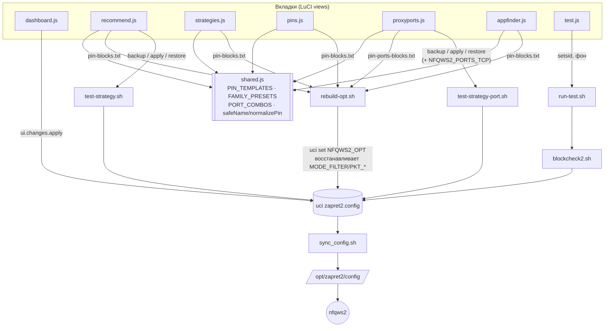

# ZapretRemix — Карта проекта

> Этот файл — единственный ознакомительный документ для этого проекта — для
> человека, подхватывающего его заново, или для **любого ИИ-инструмента** (не
> только Claude), продолжающего работу с нуля. Читайте это перед тем, как
> трогать код. Поддерживайте его в актуальном состоянии: как только фича
> выходит или решение меняется, обновляйте соответствующий раздел здесь же, в
> той же сессии. (Та же конвенция, что и у соседних проектов пользователя —
> см. `PROJECT_MAP.md` в `OpenwrtDPI`/DPISCAN, `SSDDef`/CIPHERDEN и др.)

---

## 1. Что это такое

**ZapretRemix** — кастомный LuCI-модуль (веб-интерфейс OpenWrt, раздел
Services → ZapretRemix) поверх уже установленного `zapret2`
(`bol-van/zapret2` + пакетирование `remittor/zapret-openwrt`,
`luci-app-zapret2`). Не форк и не замена `zapret2` — работает с тем же
`/etc/config/zapret2` и теми же скриптами (`sync_config.sh`, `def-cfg.sh`,
`blockcheck2.sh`), переиспользует JS-модуль `env.js` из `luci-app-zapret2`
(`'require view.zapret2.env as env_tools'`).

**Зачем:** `zapret2` — мощный, но требует ручного uci/SSH для всего, кроме
базового старт/стоп. ZapretRemix даёт: диагностику по домену (DNS-подмена /
IP-блок / DPI-блок), автоперебор стратегий с результатом, точечное
закрепление стратегии+DNS под конкретный сервис (в т.ч. группой связанных
доменов — важно, у сервиса почти всегда несколько доменов, не один), и
экспериментальную поддержку SOCKS5/HTTP-прокси по порту (без домена).

**Целевой роутер сессии:** Xiaomi Redmi AX6S, OpenWrt 24.10.2 — но
архитектурно должен работать на любом OpenWrt с уже установленным
`zapret2`/`luci-app-zapret2`.

**Репозиторий:** `github.com/Noahbenlameh/ZapretRemix`, публичный.
**Лицензии в репозитории пока нет** — см. `AUDIT.md` (не в git, локальный
файл с честной оценкой проекта — лицензия/атрибуция там в приоритетном
списке доработок).

---

## 2. Архитектура

### Два слоя, не путать
- **`zapret2` (вендор, не наш код)** — движок (`nfqws2`), его собственный
  uci-конфиг `zapret2.config`, его скрипты в `/opt/zapret2/*`
  (`def-cfg.sh`, `sync_config.sh`, `blockcheck2.sh`). Мы это не
  редактируем и не копируем в репозиторий как исходники — только вызываем
  через уже установленные интерфейсы.
- **ZapretRemix (наш код)** — LuCI JS-вьюхи + свои shell-скрипты в
  `/opt/zapretremix/*` + свои JSON/txt-файлы состояния там же. Пишет в тот
  же `zapret2.config` через `uci`, но никогда напрямую не редактирует
  файлы `/opt/zapret2/*`.

### `shared.js` — центральный модуль (важный гочка LuCI)
Общие константы для Закреплённых/Стратегий/Рекомендаций/Прокси-по-портам/
App Finder: `PIN_TEMPLATES` (4 шаблона стратегий, скопированы дословно с
установленного на роутере `def-cfg.sh` — не с GitHub, апстрим давно ушёл
на другие пресеты), `PRESET_CHOICES`/`STRATEGY_TITLES`, `FAMILY_PRESETS`
(готовые мульти-доменные наборы: youtube/discord/instagram/twitter/
facebook/whatsapp/telegram/netflix/spotify/twitch/steam/linkedin),
`PORT_COMBOS` (5 "слепых" комбо для порт-стратегий), плюс хелперы
`safeName`/`fillHostlist`/`parseDomains`/`normalizePin`.

**Важно для любого будущего shared/data-модуля в этом приложении:**
LuCI-загрузчик `require` автоинстанцирует то, что вернул файл-модуль, и
требует, чтобы это был класс-наследник `baseclass`. Голый `return {...}`
ломается в рантайме с `"...factory yields invalid constructor"` — нужно
`'require baseclass';` наверху и `return baseclass.extend({...})` внизу,
не просто объект.

### Пайплайн "закрепления" (единый для доменов и портов)
Любая вкладка, добавляющая/удаляющая закрепление (`pins.js`,
`recommend.js`, `appfinder.js`, `proxyports.js`), в конце вызывает один и
тот же `/opt/zapretremix/rebuild-opt.sh <presetKey>`. Скрипт:
1. Через `. /opt/zapret2/def-cfg.sh; set_cfg_nfqws_strat "$PRESET" zapret2`
   генерирует "чистый" `NFQWS2_OPT` под текущий глобальный пресет.
2. Дописывает поверх блоки из `pin-blocks.txt` (домены) и
   `pin-ports-blocks.txt` (порты) — с дедупликацией `--blob=` (дубли имён
   блобов между глобальным пресетом и пином иначе тихо роняют демон).
3. **Восстанавливает `MODE_FILTER` и 4 поля глубины пакетов**, которые
   `set_cfg_nfqws_strat` тихо сбрасывает как побочный эффект (см. §9 —
   это был реальный найденный баг, не гипотетический).

Всегда после — вызывающий код делает `sync_config.sh` + `zapret2 restart`
сам (не внутри `rebuild-opt.sh`).

**Почему сборка "reset + append" сделана одним shell-скриптом, а не
через клиентский `uci.js` пошагово:** чтение только что записанного
другим процессом uci-значения через клиентский `uci.get()` оказалось
ненадёжным на этом роутере на практике (несколько раз ловили баг именно
на этом). Раз навсегда решено: любой "прочитать то, что только что
записал отдельный shell-процесс" — делать полностью внутри одного
shell-скрипта через `uci get`/`uci set`/`uci commit`, не через клиентский
JS read-back.

### Данные о закреплениях
`pins.json`: массив `{ id, domains: [...], preset, dns }` — один пункт
может держать несколько доменов с общей стратегией/DNS (важно: у сервиса
почти всегда есть CDN/API-домены помимо главного). Старый формат (одно
поле `domain`) читается прозрачно через `shared.normalizePin()`.

`proxy-profiles.json`: массив `{ id, name, type: socks5|http, host, port,
user, pass, dns, rotateUrl, combo }` — независимая структура, отдельный
файл, отдельные `pin-ports-*`-файлы, не смешивается с доменными пинами.

### ACL-модель
`usr/share/rpcd/acl.d/luci-app-zapretremix.json` — file-права строго
скоуплены на `/opt/zapretremix/*` и конкретные вендорские пути, которые
реально вызываются (`sync_config.sh`, `blockcheck2.sh`,
`/etc/init.d/zapret2*`, `/etc/init.d/dnsmasq*`). `uci`-права — только
`zapret2`/`dhcp`/`network` (dhcp+network нужны из-за DNS-режимов и
per-пин DNS через `dhcp.@dnsmasq[0].server`). `/bin/busybox*` разрешён на
exec широко — но это гейтит только буквальный `fs.exec`-таргет, не то,
что busybox дальше сам исполняет через `sh -c` (там дальше `curl`,
`nslookup`, `grep` и т.д. работают через `$PATH`, отдельных ACL-записей
не требуют).

### Безопасность выполнения shell-команд (паттерн, соблюдать везде)
Пользовательский ввод (логин/пароль прокси, домены, DNS-сервер) никогда
не должен буквально конкатенироваться в строку `sh -c '...'`. Два
принятых безопасных паттерна:
1. Санитизация под безопасный алфавит перед использованием (домены —
   `[a-zA-Z0-9.-]`, см. `sanitizeDomain`/`shared.safeName`/
   `shared.parseDomains`) — используется почти везде.
2. Передача как argv-элемент или через ENV (3-й параметр `fs.exec`),
   подставляемый в команду только через `"$VAR"` (двойные кавычки —
   значение подставляется, но не перепарсится как шелл-синтаксис) — так
   сделано в `proxyports.js`'s `buildCurlCmd`/`buildCurlEnv` для
   логина/пароля прокси, которые могут содержать что угодно.

**Найденная и исправленная реальная дыра (2026-08-24, аудит):**
`recommend.js`'s DNS-пул брал сырое значение поля ввода без санитизации
и подставлял в `sh -c "nslookup domain SERVER"` — исправлено фильтром по
безопасному алфавиту при добавлении в пул.

---

## 3. Структура репозитория

```
ZapretRemix/
├── install.sh                              копирует всё на роутер, сидит .default-файлы (не перезаписывая существующие), рестарт rpcd, чистка кеша LuCI
├── README.md                               краткий публичный обзор (частично устарел — см. §6 п.2 задач)
├── PROJECT_MAP.md                          этот файл
├── AUDIT.md                                НЕ в git (.gitignore) — честная внутренняя оценка проекта (аналоги/легальность/монетизация/техдолг)
├── .gitignore
├── usr/share/
│   ├── luci/menu.d/luci-app-zapretremix.json   10 пунктов меню, order 10..80
│   └── rpcd/acl.d/luci-app-zapretremix.json    права доступа (см. §2)
├── www/luci-static/resources/view/zapretremix/
│   ├── shared.js          центральный модуль констант/хелперов (см. §2)
│   ├── dashboard.js       статус демона, старт/стоп/рестарт, MODE_FILTER+глубина пакетов (ui.changes.apply), DNS (4 режима)
│   ├── recommend.js       диагноз по домену (DNS/IP/DPI) + автоперебор стратегий пулом доменов + закрепление пула
│   ├── strategies.js      выбор глобального пресета, сырое редактирование NFQWS2_OPT/портов, appendPins после apply
│   ├── resources.js       hostlist + exclude-list для режима "только выбранные сайты"
│   ├── pins.js             Закреплённые — мульти-доменные пины со своей стратегией+DNS
│   ├── proxyports.js      ЭКСПЕРИМЕНТ: SOCKS5/HTTP прокси по порту — блайнд-стратегии, автотест, закрепление
│   ├── test.js            Тест и анализ — фоновый запуск blockcheck2.sh (10-30 мин), опрос результата
│   ├── appfinder.js       захват DNS-запросов (найти домены приложения) + закрепление найденного группой
│   ├── logs.js            просмотр лога демона, размер файла, /tmp-заметка (RAM, не флешка)
│   ├── update.js          обновление самого zapret2 (update-pkg.sh), не ZapretRemix
│   └── help.js            визуальная инструкция внутри приложения (карточки/цветные подсказки, не сплошной текст)
├── opt/zapretremix/
│   ├── rebuild-opt.sh              ядро пайплайна закреплений (см. §2)
│   ├── test-strategy.sh            backup/apply/restore NFQWS2_OPT для теста ОДНОГО домена/пула (recommend.js)
│   ├── test-strategy-port.sh       то же для портов — ТАКЖЕ бэкапит/восстанавливает NFQWS2_PORTS_TCP (порт прокси иначе не встанет в очередь)
│   ├── run-test.sh                 фоновый (setsid) обёрточный запуск blockcheck2.sh для Тест и анализ
│   ├── dns-pool.txt.default        сид для пула DNS в Рекомендациях (копируется один раз при первой установке)
│   └── pins.json.default           сид для Закреплённых (пустой массив)
```

Дерево внутри репозитория 1:1 повторяет пути на роутере — `install.sh`
просто копирует их на место.

---

## 4. Диаграмма — поток данных при закреплении/тесте



Если структура пайплайна меняется (новый источник блоков, новый скрипт
между uci и демоном) — обновляй и текст §2, и эту диаграмму, они должны
описывать одно и то же.

---

## 5. Подробная инструкция по использованию (все вкладки, детально)

*(Более развёрнутая версия того, что кратко и визуально показано во
вкладке "Инструкция" самого приложения — там нарочно сжато под интерфейс,
здесь — полностью, для справки.)*

### Дашборд
Статус демона (РАБОТАЕТ/ОСТАНОВЛЕН), кнопки Старт/Стоп/Рестарт.
**Режим фильтрации**: `none` (весь трафик, максимальная нагрузка,
диагностика), `hostlist` (только домены из Ресурсов/Закреплённых),
`autohostlist` (демон сам определяет проблемные домены по признакам
DPI-вмешательства — рекомендуемый по умолчанию). **Глубина пакетов**:
пресеты 20/100/1000/100000 (TCP out, остальные поля пропорционально).
Применение режима+глубины идёт через `uci.set()`+`uci.save()`+
`ui.changes.apply(true)` — **не** через собственный таймер (тот был и
его убрали, см. §9). **DNS**, 4 режима: авто (DHCP провайдера, ничего не
задано в uci), публичный (8.8.8.8+1.1.1.1, зафиксировано), по IP
(зафиксированный текущий IP провайдера — полезно для диагностики и чтобы
не потерять DNS провайдера при смене DHCP), свой (ручной ввод). Применяется
тем же `ui.changes.apply(true)`.

### Рекомендации
Вводишь домен → "Проверить и получить рекомендации". Показывает: что
отдаёт системный резолвер / DNS провайдера напрямую / пул DNS-серверов
(отдельная секция ниже, редактируемый список); если провайдер
подделывает/блокирует DNS-ответ — явная рекомендация, какой сервер
использовать. Дальше `curl --resolve` на лучший найденный IP — код `0` =
доступен без обхода, `28` = похоже на IP-блокировку (**zapret тут не
поможет**, но стратегия всё равно предлагается ниже — специально по
просьбе пользователя, IP-блок решается вне рамок инструмента), другой код
= похоже на DPI-блокировку. Если домен — известный член
`FAMILY_PRESETS` (например `youtube.com`), автоматически подставляется
вся связанная группа доменов в редактируемое поле — "Протестировать
стратегии автоматически" гоняет 4 пресета (`default`, `v1_by_AnonymTsk`,
`v1_by_Schiz23`, `v2_by_Schiz23`) против **всего пула** (~30-40 сек,
общий обход дома на это время временно пропадает), показывает
`N/M сработало` на каждый, "Закрепить" пинует всю группу разом.

### Стратегии
Выбор одного из 5 глобальных пресетов (тех же 4 + `v1_by_Routerich`,
которая слишком сложная/захардкоженная под google.com, чтобы
шаблонизировать под Закреплённые — доступна только тут, как "сырой"
глобальный выбор). Плюс сырой редактор `NFQWS2_OPT`/портов TCP/UDP
напрямую (для тех, кто знает, что делает). После применения пресета
автоматически дописываются все текущие пины (домены+порты) — глобальная
смена стратегии не стирает закреплённое.

### Ресурсы
Простой список доменов для режима `hostlist` + список исключений (эти
никогда не трогает стратегия, что бы ни было выставлено). Автозагрузка
официального реестра заблокированных доменов **не подключена** —
осознанно, риск случайной перезаписи.

### Закреплённые
Один пункт = один или несколько доменов (через запятую/с новой строки в
текстовом поле) + своя стратегия + опционально свой DNS
(`dhcp.@dnsmasq[0].server`, формат `/домен/IP`, независимо от режима на
Дашборде). Кнопки "Набор: …" одним кликом заполняют текстовое поле
полным списком известного сервиса. **Главная ловушка, которую тут
специально объясняют в UI**: закрепление только `youtube.com` не чинит
видео — оно грузится с `googlevideo.com`/`ytimg.com`/`ggpht.com`,
отдельных доменов с отдельным DNS.

### Прокси по портам (эксперимент)
Для SOCKS5/HTTP-прокси — нет домена, значит нет `--filter-l7`, значит
"слепая" правка по фиксированной позиции байт (5 комбо в
`shared.PORT_COMBOS`). Добавляешь профиль (хост/порт/логин/пароль,
DNS-поле пока только для памяти, ссылка смены IP — кнопка дёргает её
через curl). "Подобрать автоматически" гоняет 5 комбо, проверяет через
реальный `curl` **через сам прокси** (SOCKS5-hostname/-x), учитывая, что
**во время теста** порт временно добавляется в `NFQWS2_PORTS_TCP` (иначе
трафик до демона вообще не долетит) и **полностью откатывается** после.
При постоянном закреплении **порт в `NFQWS2_PORTS_TCP` НЕ добавляется
автоматически** (осознанно — это поле независимо редактируется на
Стратегиях, авто-мердж туда — ловушка рассинхрона) — UI прямо просит
добавить его туда вручную один раз, показывая текущее значение поля.
**Если прокси и так работает без всякой стратегии — закреплять нечего**,
чистый минус без плюса (см. диалог в памяти проекта). UDP-релей SOCKS5 и
HomeProxy-туннели (VLESS/Hysteria/TUIC) сознательно не поддерживаются —
curl не умеет тестировать SOCKS5 UDP ASSOCIATE, а HomeProxy это вообще
другая архитектура (роутер как исходящий клиент, не прокси, к которому
стучимся).

### Тест и анализ
Настоящий `blockcheck2.sh` — десятки стратегий, 10-30+ минут, демон
останавливается на время теста. Запускается в фоне (`setsid`, переживает
закрытие вкладки/браузера), можно вернуться и нажать "Показать текущий
результат". "Остановить проверку" убивает `blockcheck2.sh`/`curl`/
осиротевшие тестовые `nfqws2` и поднимает настоящий демон обратно.

### Поиск по приложению
"Начать захват" включает `dnsmasq.@dnsmasq[0].logqueries=1`, "Остановить
и показать" читает `logread | grep query`, парсит домены, даёт отметить
галочками. Два способа применить: в "Ресурсы" (простой список) или
**"Закрепить выбранные как группу"** (сразу отдельный пин со своей
стратегией/DNS, тот же путь, что и в Закреплённых). **Важная оговорка,
которую стоит помнить**: видит только DNS-запросы, реально дошедшие до
dnsmasq роутера — прокси/антидетект с собственным (remote) DNS-резолвингом
или браузеры с включённым DoH тут невидимы в принципе, не баг, а
архитектурный предел метода.

### Логи
Лог демона (`DAEMON_LOG_ENABLE` вкл/выкл), просмотр последних 300 строк,
показ текущего размера файла. Файл в `/tmp` (RAM, не флешка) — не жрёт
место на устройстве, но может расти в ОЗУ, если оставить включённым
надолго; не предназначено для постоянной работы.

### Обновление
Только для самого `zapret2`/`luci-app-zapret2` (через вендорский
`update-pkg.sh -c`/`-u 2`). ZapretRemix обновляется отдельно, той же
командой через GitHub-тарбол, что и при установке (см. §7).

### Инструкция
Визуальная версия части этого раздела прямо в интерфейсе — карточки
вкладок, цветные подсказки, шаги "с чего начать". Обновляется вместе с
любой сменой поведения (например, была переписана целиком 2026-08-24
после того, как обнаружилось, что старая версия описывала уже удалённый
ручной таймер отката).

---

## 6. Текущий статус / дорожная карта

| Область | Статус | Где |
|---|---|---|
| Базовый Дашборд (статус/старт-стоп/режим/глубина/DNS) | ✅ готово, живьём проверено | `dashboard.js` |
| Рекомендации (диагноз + автотест + пул-закрепление) | ✅ готово, живьём проверено | `recommend.js` |
| Стратегии/Ресурсы/Логи/Обновление/App Finder | ✅ готово, живьём проверено | соотв. `*.js` |
| Закреплённые, мульти-домен | ✅ готово, живьём проверено | `pins.js`, `shared.js` |
| Прокси по портам (SOCKS5/HTTP) | ✅ построено и задеплоено, автотест на реальном прокси **не подтверждён живьём** (у пользователя прокси и так работает — тестировать было нечего) | `proxyports.js` |
| UDP-релей для SOCKS5-прокси | ❌ осознанно отложено — curl не умеет SOCKS5 UDP ASSOCIATE | — |
| Интеграция с HomeProxy/VLESS/Hysteria/TUIC (VPN-туннели на роутере) | ❌ не начато, другая архитектура, ждёт конкретного случая | — |
| Наборы доменов по антидетект-браузерам (Сфера/Окто/Мультилогин) | ❌ отклонено — нет проверенных данных, вместо этого App Finder | — |
| Наборы по VPS-провайдерам | ❌ отклонено — нет конкретики, ждёт названий провайдеров | — |
| Авто-вычленение связанных доменов (сертификаты/co-occurrence) | ❌ явно отложено пользователем ("нет пока не делаем") | — |
| LICENSE-файл | ❌ отсутствует — см. `AUDIT.md`, приоритет №1 если проект остаётся публичным | — |
| Явная атрибуция Schiz23/AnonymTsk в README | ❌ отсутствует — см. `AUDIT.md` | — |
| Автотесты (юнит-тесты чистых функций shared.js) | ❌ нет вообще — весь QA был вручную по SSH | — |
| Упаковка через opkg вместо git-тарбола | ❌ нет — конкуренты (`1andrevich/zapret2-openwrt`, `spvkgn/zapret-openwrt-luci-app`) уже так делают | — |

Полная сравнительная оценка (аналоги, монетизация, техдолг по
приоритету) — в `AUDIT.md` (не в git).

---

## 7. Как устанавливать / разрабатывать

**Установка/обновление на роутере** (с самого роутера по SSH):
```sh
rm -rf /tmp/zr && mkdir -p /tmp/zr
curl -fsSL -o /tmp/zr.tar.gz https://api.github.com/repos/Noahbenlameh/ZapretRemix/tarball/master
tar -xzf /tmp/zr.tar.gz -C /tmp/zr
sh /tmp/zr/*/install.sh
```
Затем в браузере — жёсткое обновление страницы (Ctrl+Shift+R/Cmd+Shift+R),
Services → ZapretRemix. `install.sh` никогда не перезаписывает
`dns-pool.txt`/`pins.json`, если они уже существуют (сохраняет
пользовательские правки при переустановке).

**Проверка перед коммитом** (локально, на машине разработки — нет
реального прогона на роутере без деплоя):
```sh
for f in www/luci-static/resources/view/zapretremix/*.js; do node --check "$f"; done
for f in opt/zapretremix/*.sh; do sh -n "$f"; done
python3 -c "import json,glob; [json.load(open(f)) for f in glob.glob('usr/share/**/*.json', recursive=True)]"
```
Это только синтаксис — **не** замена живой проверки на роутере (`ps |
grep nfqws2`, `uci show zapret2.config...`). Минимум трижды за сессию
баг находился только через живой тест (дублирующиеся `--blob=`,
MODE_FILTER-сброс, коллизия тестовых файлов) — синтаксическая проверка
их не ловит.

**Git:** обычный `git add`/`commit`/`push` на `master`, публичный
репозиторий. `AUDIT.md` в `.gitignore` — не пушится намеренно.

---

## 8. Проверено на роутере (Xiaomi AX6S, живьём, с датами)

- 2026-08-23/24 — базовый Дашборд, Стратегии, Ресурсы, Закреплённые
  (один домен), Рекомендации: всё подтверждено рабочим через реальные
  SSH-проверки (`ps`, `uci show`) и клики по интерфейсу.
- Дедупликация `--blob=` при совпадении пресетов пина и глобальной
  стратегии — воспроизведён реальный краш демона (`ps` показывал ноль
  процессов `nfqws2`), исправлено, перепроверено.
- DNS 4 режима — `PermissionError` на `uci.save()` для `network.wan`,
  исправлено переходом на `ui.changes.apply(true)`, перепроверено.
- MODE_FILTER-таймер-гонка (Дашборд) — воспроизведён реальный откат
  режима, исправлено убиранием собственного таймера, перепроверено
  пользователем ("работает. все ок.").
- Мульти-доменные Закреплённые — не поймано отдельно живьём после
  рефакторинга формата `pins.json`, но синтаксически проверено, и все
  последующие фичи (Рекомендации-пул, App Finder-группа) построены
  поверх того же формата без нареканий.
- `shared.js`/`baseclass.extend()` — сломалось живьём при первом деплое
  (`"factory yields invalid constructor"`), исправлено, перепроверено
  пользователем ("работает. все ок.").
- **MODE_FILTER-сброс в `rebuild-opt.sh` (главная находка вопроса №6
  пользователя, 2026-08-24)** — подтверждено живым дампом `uci show
  zapret2` + `/opt/zapret2/config`: `MODE_FILTER=hostlist` вместо
  ожидаемого `autohostlist` после серии добавлений в Закреплённые.
  Исправлено, пользователь подтвердил ("все ок.") после редеплоя.
- Прокси по портам — задеплоено, `netstat -nu` подтвердил отсутствие
  UDP-трафика через реальный прокси пользователя (ожидаемо), но сама
  функция подбора стратегии на реальном SOCKS5 **не была прогнана**
  (прокси и так работал, тестировать было нечего).
- Security-fix (DNS-пул, shell-инъекция) — исправлено 2026-08-24, **не
  было отдельно перепроверено живьём** (низкий риск, тривиальная
  санитизация, синтаксис проверен).

---

## 9. Решения и уроки, которые стоит запомнить

- **`sync_config.sh` всегда после любой правки uci `zapret2.*`** — она
  генерирует кэшированный рантайм-конфиг `/opt/zapret2/config`; без
  этого шага изменения не долетают до демона, даже если `uci show`
  показывает новое значение. Забыть этот шаг в ручной SSH-проверке уже
  один раз давало ложное впечатление бага там, где его не было.
- **Клиентский `uci.js` read-back после стороннего shell-процесса —
  ненадёжен.** Решать read-modify-write целиком внутри одного
  shell-скрипта через `uci get`/`uci set`/`uci commit`, не мешать
  клиентский JS с параллельной shell-записью.
- **`uci.save()` в LuCI — только клиентское стейджирование**, реально
  не коммитит и не перезагружает сервисы сам по себе. Для настоящего
  применения+отката — `ui.changes.apply(checked)` (штатный механизм
  LuCI, с серверным вотчдогом доступности), не собственный
  JS-таймер/`setInterval` — тот создаёт гонку с нативным индикатором
  "Несохранённые изменения" (см. диагностированный баг MODE_FILTER на
  Дашборде).
- **`--blob=NAME:...` глобален на весь вызов `nfqws2`**, не скоупится
  внутри одного `--new`-блока — повтор имени между глобальной
  стратегией и пином тихо роняет демон без вменяемой ошибки в логах.
- **`set_cfg_nfqws_strat` (вендорская функция `def-cfg.sh`) может
  сбрасывать поля за пределами того, что явно кажется её задачей** —
  подтверждено на `MODE_FILTER`. Любой будущий код, вызывающий её,
  обязан снапшотить/восстанавливать соседние поля, которыми управляет
  ZapretRemix, а не полагаться, что вендорский вызов ограничен ровно
  тем uci-полем, которое как бы должен трогать.
- **Инициализационный скрипт `/etc/init.d/zapret2` не проверяет, что
  демон реально выжил после "старта"** — вывод "Starting daemon 1: ..."
  ничего не гарантирует. Любая проверка "применилось ли" — обязательно
  `ps | grep nfqws2`, не полагаться на текст вывода команды рестарта.
- **Shell-инъекция через пользовательский ввод, попадающий в `sh -c`** —
  реальный, не теоретический риск в этом приложении (см. §2, найдено
  аудитом). Правило: либо санитизация под безопасный алфавит перед
  использованием, либо ENV+`"$VAR"`, никогда голая конкатенация строки.

---

## 10. Контекст происхождения (полная история — в памяти Claude, не здесь)

Полная история сессии (диагностика youtube-throttling, обсуждение
хардверного ускорения, разбор антидетект/прокси-сценариев, все вопросы
пользователя и решения по каждому) хранится в памяти Claude,
`project_zapretremix.md` (и смежная `project_zapret2_openwrt_setup.md`
про сам роутер/базовую настройку `zapret2` до появления ZapretRemix).
Этот файл — только про кодовую базу как она есть сейчас, не хронология
"как дошли до жизни такой".
